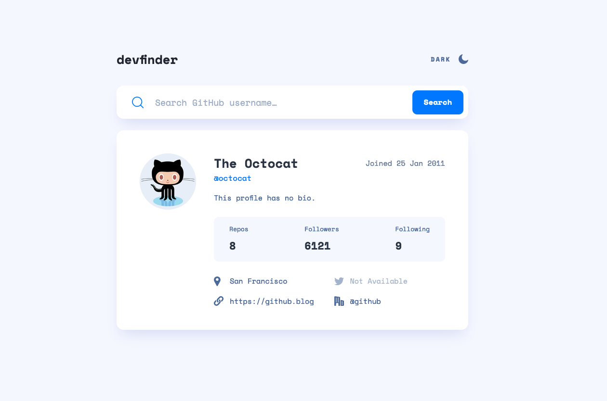

# Frontend Mentor - GitHub user search app solution

This is a solution to the [GitHub user search app challenge on Frontend Mentor](https://www.frontendmentor.io/challenges/github-user-search-app-Q09YOgaH6). Frontend Mentor challenges help you improve your coding skills by building realistic projects.

## Table of contents

- [Overview](#overview)
  - [The challenge](#the-challenge)
  - [Screenshot](#screenshot)
  - [Links](#links)
- [My process](#my-process)
  - [Built with](#built-with)
  - [What I learned](#what-i-learned)
  - [Continued development](#continued-development)
  - [Useful resources](#useful-resources)
- [Author](#author)
- [Acknowledgments](#acknowledgments)

**Note: Delete this note and update the table of contents based on what sections you keep.**

## Overview

### The challenge

ユーザーができること:

- デバイスの画面サイズに応じて、アプリの最適なレイアウトを表示します
- ページ上のすべてのインタラクティブ要素のホバー状態を確認できる
- ユーザー名で GitHub ユーザーを検索する
- 検索に基づいて関連するユーザー情報を表示する
- ライトテーマとダークテーマを切り替える

### Screenshot



### Links

- Solution URL: [リンク](https://github.com/Kaji1127/github-search-app)
- Live Site URL: [リンク](https://react-github-user-search-application.netlify.app/)

## My process

### Built with

- CSS custom properties
- Flexbox
- CSS Grid
- Mobile-first workflow
- Sass
- [React](https://reactjs.org/) - JS library

### What I learned

axios を使ってサーバからデータの取得を行う方法を学んだ。

コードスニペット:

```js
await axios.get(`${baseURL}/${user}`).catch((err) => console.log(err));
```
